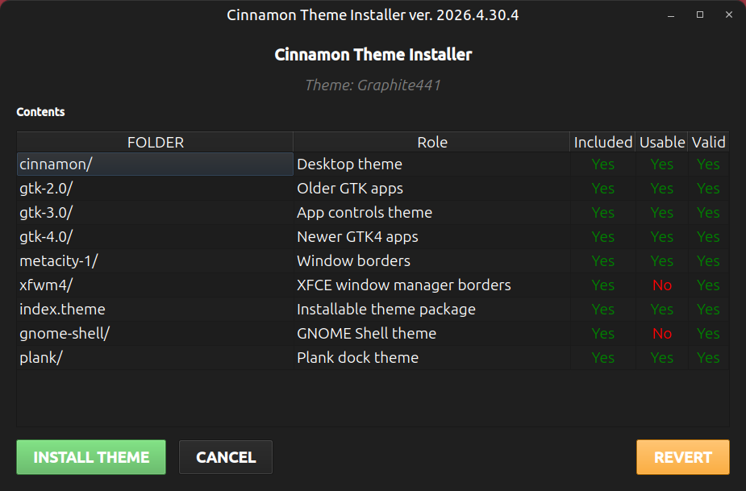

# Cinnamon Theme Installer

Travis L. Seymour, PhD | April 30 2026

---

> currently aimed at installing themes from here: https://www.opendesktop.org/s/cinnamon/browse?cat=133&ord=latest, and https://www.gnome-look.org/browse?cat=133&ord=latest. Themes from elsewhere could work, but are untested.

---

## [](cinnamon_theme_installer/interface.png)

## How-To

### Install The App

1. Install `uv` if it is not already installed: https://docs.astral.sh/uv/getting-started/installation/
2. Install the app:

```bash
uv tool install git+https://www.github.com/travisseymour/cinnamon-theme-installer.git
```

### Run The App

1. Download a theme from https://www.opendesktop.org/s/cinnamon/browse?cat=133&ord=latest (e.g., [Graphite441-Cinnamon.tar.gz)](https://www.opendesktop.org/p/2354738)
2. Start cinnamon-theme-installer, e.g. run `cti` or `cinnamon-theme-installer` on the commandline.
3. Drag tar.gz file onto the GUI.
4. If all checks pass, press the **[INSTALL THEME]** button.

### Nevermind

1. Just run the app and then press the **[REVERT]** button. It will install the default dark theme.

### Uninstall The App

```bash
uv tool install
```
